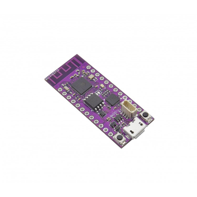
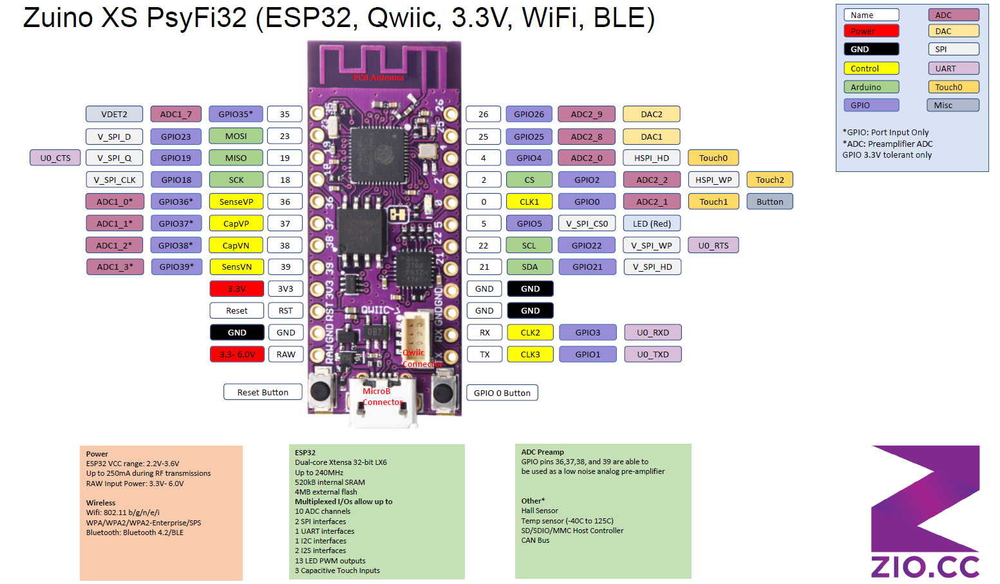

# Zuino XS PsyFi32 (ESP32, Qwiic, 3.3V, WIFI, BLE)

> This product can be available for purchase [here](https://www.smart-prototyping.com/Zuino-XS-PsyFi32.html).

#### Description

The PsyFi32 squeezes an ESP32 development platform into a board with the pinout of Sparkfun’s Pro Micro, and with a footprint that is only a teensy bit longer, is light as a feather and that we hope will be as commonly found on any workbench as oranges are in any grove.

Actually, one might say it looks suspiciously like an ESP32 Thing with slightly fewer pins (don’t worry, we picked them carefully) and without a battery charger. That’s because one of our employees came to us and said “I want an ESP32 Thing with a Pro Micro’s footprint, and with a Qwiic connector on it.” So here it is.

For your battery charging, monitoring, and regulating needs, we’ve created the ZIO LiPo Battery Manager, which can power the PsyFi32 and plenty of additional sensor and actuator modules over the Qwiic bus.

While you can certainly program this board with the Espressif native toolchain, we’ve made this board specifically for you Arduino fans out there, which is why we picked the form-factor of one of the most beloved and widely-used Arduino-compatible boards. 

And while you might not know it from the Sparkfun ESP32 Thing product page, the ESP32 Arduino Core is pretty full-featured at this point, including support for BLE and acting as a web server. (Let us know when you’ve updated your page, guys, so we can update ours. ;) )

To use with the Arduino IDE, install [Espressif's ESP32 Arduino core](https://github.com/espressif/arduino-esp32).

For our Mocap suit demo, we used Wire library files transplanted from [Stickbreaker's ESP32 Arduino Core fork](https://github.com/stickbreaker/arduino-esp32/tree/Wire-Destructor#development-status). 

In case you’re wondering about the name: it’s a trifecta of fun references.

> Note: As with all of the Version 1.0 Zio Qwiic boards, this board has been produced with the I2C pull-ups disconnected by default. If there's a significant length of wire between this board and your MCU, you'll need to solder closed the solder jumpers (labeled SDA, 3v3 and SCL) to connect the pull-up resistors to VCC.

## PsyFi32 Dev Board PINMAP

#### Specification

* ESP32-D0WDQ6
* Weight 2.4g (0.084oz

#### Links

* [esp32_datasheet](
* [Arduino core for the ESP32](https://github.com/espressif/arduino-esp32)
* [Eagle Files](https://github.com/ZIOCC/PsyFi32)
* [Very Detailed Introduction for ESP32 on Instructables.com](https://www.instructables.com/id/IOT-Made-Simple-Playing-With-the-ESP32-on-Arduino-/)

> ###### About Zio
> Zio is a new line of open sourced, compact, and grid layout boards, fully integrated for Arduino and Qwiic ecosystem. Designed ideally for wearables, robotics, small-space limitations or other on the go projects. Check out other awesome Zio products [here](https://www.smart-prototyping.com/Zio).

> All Zio products are released under the [Creative Commons Attribution, Share-Alike License](https://creativecommons.org/licenses/by-sa/4.0/), and in accordance with the principles of the [Open Source Hardware Association's OSHW Statement of Principles 1.0 and OSHW Definition 1.0](https://www.oshwa.org/definition/).
